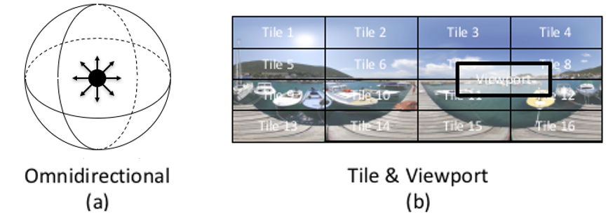
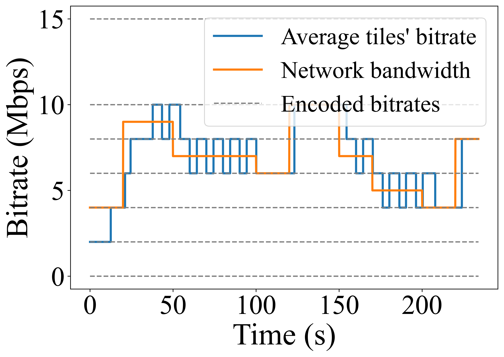
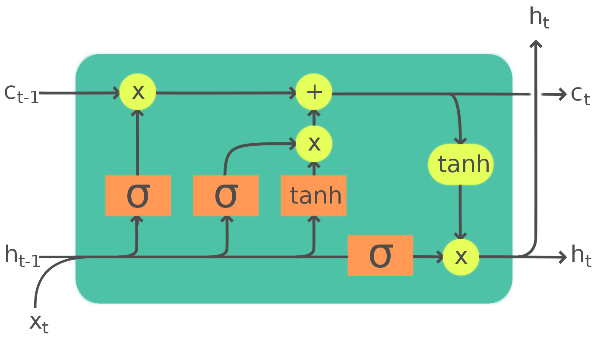
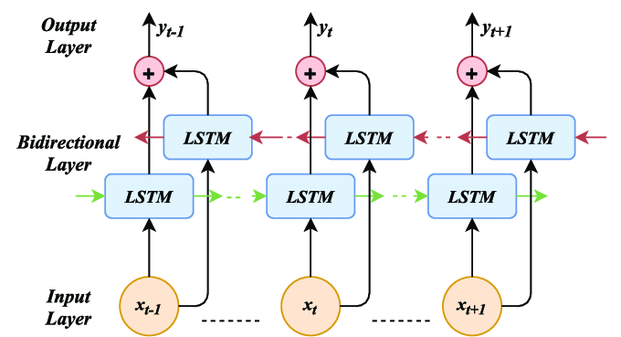
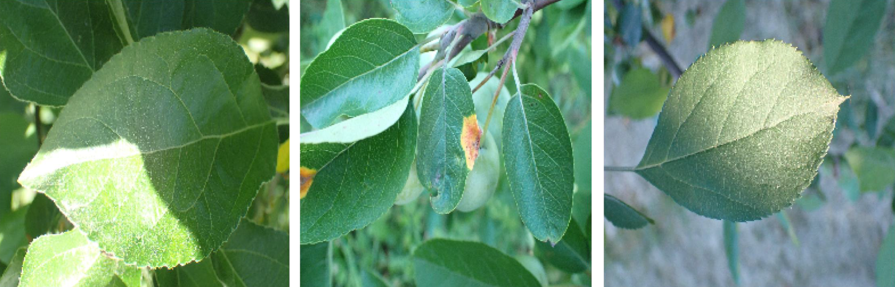
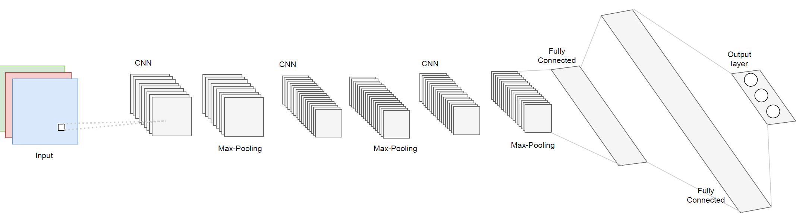

# **Biography**
I am a Ph.D. student of [Computer Science at the University of Massachusetts, Amherst](https://www.cics.umass.edu/). I do my research under the supervision of Prof. [Mohammad Hajiesmaili](https://groups.cs.umass.edu/hajiesmaili/) and [Ramesh K. Sitaraman](https://groups.cs.umass.edu/ramesh/lids-lab/) (co-adivsors). I received my master's degree from UMass with grade 4.0/4.0. Before joining UMass, I received my B.Sc. degree at the department of Computer Engineering at the Sharif University of Technology. Prof. Ali Sharifi-Zarchi was my advisor. 

Checkout my CV [here](https://ali-zeynali.github.io/home/files/CV_Ali_Zeynali.pdf)

## **Research Area**
* Online learning - Online decision making
* Online optimization
* Machine learning applications in multimedia

## **Employment**
* **Machine Learning Data Scientist** Intern, SiriusXM and Pandora, Oakland, USA, Summer 2024
    - Developed a framework to explain the similarity of a query and a document retrieved by a search ranking model.
* **Software Engineer** Intern, Google LLC., Mountain View, USA, Spring 2022
    - Developed a highly accurate model to address the interest matching points problem by employing image processing and machine learning techniques, including depth detection, and image perspective detection/modification. Successfully enhanced the performance of SOTA models by up to 50% with the final implementation.
* **Machine Learning and Data Science Researcher** , Research intern, Adobe, San Jose, USA, Summer 2021
    - Focused on enhancing user experience by optimizing PDF file interactions in liquid-mode, ensuring seamless performance in both offline and online streaming modes.

## **Publications**
*   **Near-Optimal Emission-Aware Online Ride Assignment Algorithm for Peak Demand Hours [Under review]**

    *Mahsa Sahebdel, Ali Zeynali, Noman Bashir, Ramesh Sitaraman, Mohammad Hajiesmaili*
    
*   **LEAD: Towards Learning-Based Equity-Aware Decarbonization in Ridesharing Platforms [Under review] [[PDF]](https://ali-zeynali.github.io/LEAD.pdf)**

    *Mahsa Sahebdel, Ali Zeynali, Noman Bashir, Prashant Shenoy, Mohammad Hajiesmaili*

*   **BOLA360: Near-optimal View and Bitrate Adaptation for 360-degree Video Streaming - Journal Version [Under review] [[PDF]](https://ali-zeynali.github.io/BOLA360_v2.pdf)**

    *Ali Zeynali, Mahsa Sahebdel, Mohammad Hajiesmaili, Ramesh Sitaraman*
    
*   **Robust Learning-Augmented Dictionaries [ICML 2024] [[PDF]](https://ali-zeynali.github.io/RobustSL.pdf)**

    *Ali Zeynali, Shahin Kamali, Mohammad Hajiesmaili*
    
*   **BOLA360: Near-optimal View and Bitrate Adaptation for 360-degree Video Streaming [ACM MMSys 2024] [[PDF]](https://ali-zeynali.github.io/BOLA360_v2.pdf)**

    *Ali Zeynali, Mohammad Hajiesmaili, Ramesh Sitaraman*
	
* **A Holistic Approach for Equity-aware Carbon Reduction of Ridesharing Platforms [ACM e-Energy 2024] [[PDF]](https://ali-zeynali.github.io/AHolisticApproach-CarbonEmission.pdf)**

    *Mahsa Sahebdel, Ali Zeynali, Noman Bashir, Prashant Shenoy, Mohammad Hajiesmaili*
    
*   **Data-driven Algorithms for Reducing the Carbon Footprint of Ride-sharing Ecosystems [ACM e-Energy 2023] [[PDF]](https://ali-zeynali.github.io/dataDriverForReducingCarbonFootpintOfRideSharingEcosystems.pdf)**

    *Mahsa Sahebdel, Ali Zeynali, Noman Bashir, Mohammad Hajiesmaili, Jimi Oke*
	
*   **SemEval-2022 Task 8: Multilingual news article similarity [SemEval 2022] [[PDF]](https://ali-zeynali.github.io/SemEval_2022Task8_MultilingualNewsArticleSimilarity.pdf)** 

	*Xi Chen, Ali Zeynali, Chico Camargo, Fabian Flock, Devin Gaffney, Przemyslaw Grabowicz, Scott Hale, David Jurgens, Mattia Samory*
	
*   **Competitive Algorithms for Online MultidimensionalKnapsack Problems [ACM SIGMETRICS 2022] [[PDF]](https://ali-zeynali.github.io/CompetitiveAlgorithmsforOnlineMultidimensionalKnapsackProblems.pdf)**

    *Lin Yang, Ali Zeynali, Mohammad Hajiesmaili, Ramesh Sitaraman, Don Towsley*
	
*	**Data-driven Competitive Algorithms for Online Knapsack and Set Cover [AAAI 2021] [[PDF]](https://ali-zeynali.github.io/DatadrivenCompetitiveAlgorithmsforOnlineKnapsackandSetCover.pdf)**

    *Ali Zeynali, Bo Sun, Mohammad Hajiesmaili, Adam Wierman*
	
*   **Competitive Algorithms for the Online Multiple KnapsackProblem with Application to Electric Vehicle Charging [ACM SIGMETRICS 2021] [[PDF]](https://ali-zeynali.github.io/CompetitiveAlgorithmsfortheOnlineMultipleKnapsack.pdf)**

    *Bo Sun, Ali Zeynali, Tongxin Li, Mohammad Hajiesmaili, Adam Wierman, Danny H.K. Tsang*

## **Selected Projects**
* **VSE360: Online 360-degree video streaming simulation evironment [[Github]](https://github.com/ali-zeynali/VSE360)** 

    *Fully simulated python environment to evaluate 360-degree ABR algorithms*

* **AI-Generated music using Deep Learning + LSTM [[Github]](https://github.com/ali-zeynali/MusicGen)** 

    *Generating music using deep learning techniques, and LSTM networks*

* **AI-Generated short stories using bidirectional LSTM [[Github]](https://github.com/ali-zeynali/ShortStoryGenerator)** 

    *Generating short/tiny stories with deep LSTM*
    

* **ZeySed: Deep neural networks for leave classification [[Github]](https://github.com/ali-zeynali/ZeySed)** 

    *Classifying image of leaves using deep neural networks*

## **Honors and Awards:** 

* Thesis Proposal Writing Fellowship Award; Fall 2023 - University of Massachusetts, Amherst

* Nominated for the Microsoft Research Fellowship by the CICS Department; Summer 2021 - University of Massachusetts, Amherst

* Donald F. Towsley Graduate Scholarship; Summer 2021 - University of Massachusetts, Amherst

* Ranked in Top-Ten BSc. students of computer engineering, class of 2019 (among 177 students)

* Rank 24 of 10th IEEEXTREME, 24-hours programming contest among 1823 teams; Fall 2016

* Golden Medalist of 8th International Olympiad IOAA (among more than 200 international students); Summer 2014 - Romania

* Golden Medalist of 9th National Science Olympiad NOAA (among more than 5,000 students); Summer 2013

## **Contact me:** 
"a" + \[my last name \] at umass dot edu 

