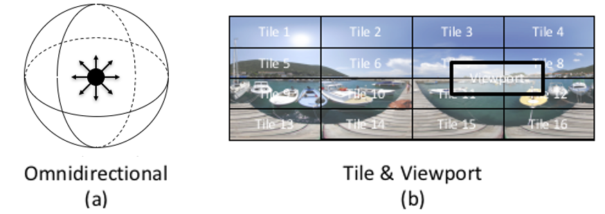
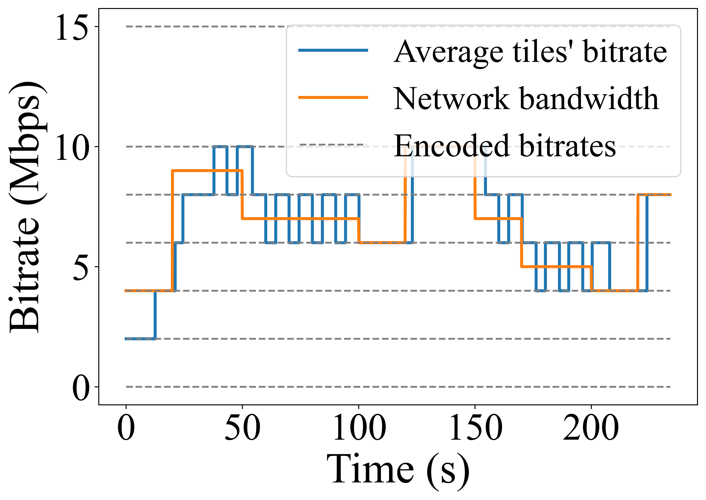
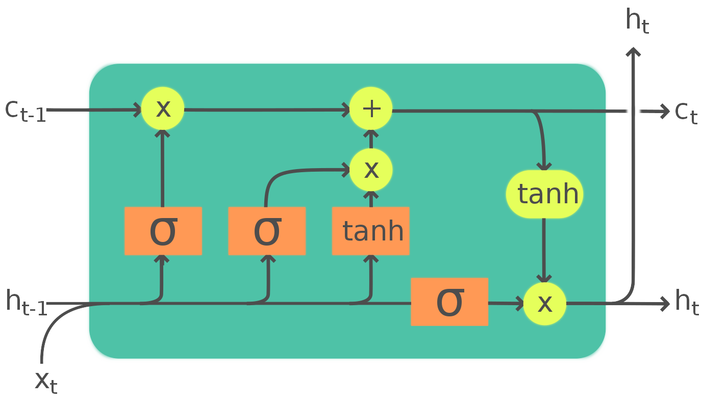
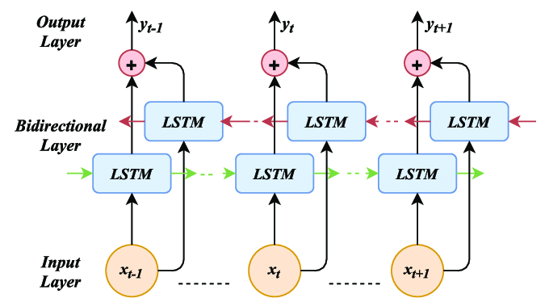
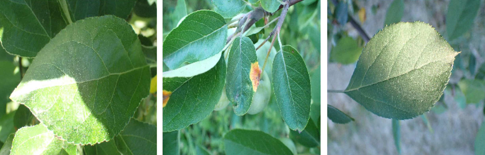
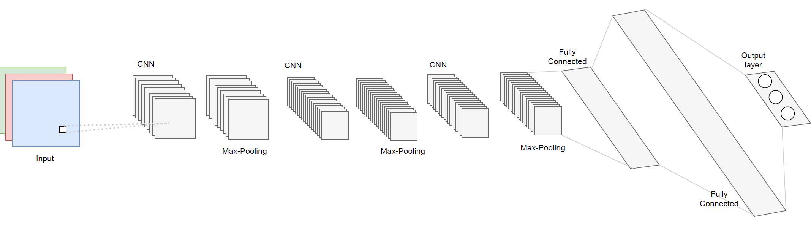

# Ali Zeynali

## About

Ph.D. student in Computer Science at [UMass Amherst](https://www.cics.umass.edu/), advised by Prof. [Mohammad Hajiesmaili](https://groups.cs.umass.edu/hajiesmaili/) and Prof. [Ramesh K. Sitaraman](https://groups.cs.umass.edu/ramesh/lids-lab/).

I design robust learning and online decision-making algorithms for large-scale ML systems, with emphasis on data-efficient fine-tuning under limited or noisy data.

  <a href="/home/files/CV_Ali_Zeynali.pdf" class="button-link">CV</a>
  <a href="https://scholar.google.com/citations?user=WpCU1L4AAAAJ&hl=en" class="button-link">Google Scholar</a>
  <a href="https://github.com/ali-zeynali" class="button-link">GitHub</a>
  <a href="https://www.linkedin.com/in/ali-zeynali/" class="button-link">LinkedIn</a>

  

    <h3>Research</h3>
    
Online learning, decision-making, and trustworthy ML with a focus on robust, learning-augmented methods.

  

  

    <h3>Engineering</h3>
    
I had industry experience at Google, Adobe, Airbnb, and SiriusXM/Pandora working on cutting-edge technologies and scalable AI models.

  

  

    <h3>Interests</h3>
    
Scalable ML systems, fine-tuning under noisy/limited data, and practical deployment.

  

## Industry Experience

- **Machine Learning Data Scientist Intern**, Airbnb (Remote), Summer/Fall 2025  
  - Built a framework to detect synthetic/manipulated images.
  - Designed methods to explain fake-image detection predictions.
- **Machine Learning Data Scientist Intern**, SiriusXM and Pandora (Oakland, USA), Summer 2024  
  - Built an explainability framework for search ranking relevance.
  - Improved prior model performance by up to 26%.
- **Software Engineer Intern**, Google (Mountain View, USA), Spring 2022  
  - Improved interest-matching accuracy with geometry/depth-aware vision methods.
  - Improved over prior SOTA models by up to 50%.
- **ML/Data Science Research Intern**, Adobe (San Jose, USA), Summer 2021  
  - Improved Adobe Liquid Mode streaming model under online/offline settings.
  - Improved quality of experience and bandwidth efficiency by up to 20%.

## Selected Publications

<input id="paper-search" class="paper-search" type="search" placeholder="Search papers by title, venue, year, or author..." aria-label="Search publications" />

  <article class="paper-item">
    <h3>Smoothed Online Optimization for Target Tracking: Robust and Learning-Augmented Algorithms</h3>
    
<strong>Venue:</strong> ALT 2026 · <a href="https://ali-zeynali.github.io/SOOTT.pdf">PDF</a>

    
Ali Zeynali, Mahsa Sahebdel, Qingong Liu, Ramesh Sitaraman, Mohammad Hajiesmaili

  </article>

  <article class="paper-item">
    <h3>LEAD: Towards Learning-Based Equity-Aware Decarbonization in Ridesharing Platforms</h3>
    
<strong>Venue:</strong> ACM FAccT 2025 · <a href="https://ali-zeynali.github.io/LEAD.pdf">PDF</a>

    
Mahsa Sahebdel, Ali Zeynali, Noman Bashir, Prashant Shenoy, Mohammad Hajiesmaili

  </article>

  <article class="paper-item">
    <h3>Robust Learning-Augmented Dictionaries</h3>
    
<strong>Venue:</strong> ICML 2024 · <a href="https://ali-zeynali.github.io/RobustSL.pdf">PDF</a>

    
Ali Zeynali, Shahin Kamali, Mohammad Hajiesmaili

  </article>

  <article class="paper-item">
    <h3>BOLA360: Near-optimal View and Bitrate Adaptation for 360-degree Video Streaming</h3>
    
<strong>Venue:</strong> ACM MMSys 2024 · <a href="https://ali-zeynali.github.io/BOLA360_v2.pdf">PDF</a>

    
Ali Zeynali, Mohammad Hajiesmaili, Ramesh Sitaraman

  </article>

  <article class="paper-item">
    <h3>A Holistic Approach for Equity-aware Carbon Reduction of Ridesharing Platforms</h3>
    
<strong>Venue:</strong> ACM e-Energy 2024 · <a href="https://ali-zeynali.github.io/AHolisticApproach-CarbonEmission.pdf">PDF</a>

    
Mahsa Sahebdel, Ali Zeynali, Noman Bashir, Prashant Shenoy, Mohammad Hajiesmaili

  </article>

  <article class="paper-item">
    <h3>Near-Optimal Emission-Aware Online Ride Assignment Algorithm for Peak Demand Hours</h3>
    
<strong>Venue:</strong> Under review · <a href="https://ali-zeynali.github.io/LARA.pdf">PDF</a>

    
Mahsa Sahebdel, Ali Zeynali, Noman Bashir, Ramesh Sitaraman, Mohammad Hajiesmaili

  </article>

  <article class="paper-item">
    <h3>Data-driven Algorithms for Reducing the Carbon Footprint of Ride-sharing Ecosystems</h3>
    
<strong>Venue:</strong> ACM e-Energy 2023 · <a href="https://dl.acm.org/doi/pdf/10.1145/3599733.3606300">PDF</a>

    
Mahsa Sahebdel, Ali Zeynali, Noman Bashir, Mohammad Hajiesmaili, Jimi Oke

  </article>

  <article class="paper-item">
    <h3>SemEval-2022 Task 8: Multilingual News Article Similarity</h3>
    
<strong>Venue:</strong> SemEval 2022 · <a href="https://ali-zeynali.github.io/SemEval_2022Task8_MultilingualNewsArticleSimilarity.pdf">PDF</a>

    
Xi Chen, Ali Zeynali, Chico Camargo, Fabian Flock, Devin Gaffney, Przemyslaw Grabowicz, Scott Hale, David Jurgens, Mattia Samory

  </article>

  <article class="paper-item">
    <h3>Competitive Algorithms for Online Multidimensional Knapsack Problems</h3>
    
<strong>Venue:</strong> ACM SIGMETRICS 2022 · <a href="https://ali-zeynali.github.io/CompetitiveAlgorithmsforOnlineMultidimensionalKnapsackProblems.pdf">PDF</a>

    
Lin Yang, Ali Zeynali, Mohammad Hajiesmaili, Ramesh Sitaraman, Don Towsley

  </article>

  <article class="paper-item">
    <h3>Data-driven Competitive Algorithms for Online Knapsack and Set Cover</h3>
    
<strong>Venue:</strong> AAAI 2021 · <a href="https://ali-zeynali.github.io/DatadrivenCompetitiveAlgorithmsforOnlineKnapsackandSetCover.pdf">PDF</a>

    
Ali Zeynali, Bo Sun, Mohammad Hajiesmaili, Adam Wierman

  </article>

  <article class="paper-item">
    <h3>Competitive Algorithms for the Online Multiple Knapsack Problem with Application to Electric Vehicle Charging</h3>
    
<strong>Venue:</strong> ACM SIGMETRICS 2021 · <a href="https://ali-zeynali.github.io/CompetitiveAlgorithmsfortheOnlineMultipleKnapsack.pdf">PDF</a>

    
Bo Sun, Ali Zeynali, Tongxin Li, Mohammad Hajiesmaili, Adam Wierman, Danny H.K. Tsang

  </article>

No papers matched your search.

## Projects

- **Robust and Unbiased Self-Play Strategy for Fine-Tuning Large Language Models**  
  Framework for fine-tuning LLMs on imbalanced datasets.

- **VSE360: Online 360-degree video streaming simulation environment** [[GitHub]](https://github.com/ali-zeynali/VSE360)  
  Fully simulated Python environment for evaluating 360-degree ABR algorithms.

  
  

- **AI-Generated Music using Deep Learning + LSTM** [[GitHub]](https://github.com/ali-zeynali/MusicGen)  
  Music generation with deep sequence models.

  

- **AI-Generated Short Stories using Bidirectional LSTM** [[GitHub]](https://github.com/ali-zeynali/ShortStoryGenerator)  
  Tiny-story generation with deep LSTM architectures.

  

- **ZeySed: Deep neural networks for leaf classification** [[GitHub]](https://github.com/ali-zeynali/ZeySed)  
  Image classification pipeline for plant leaves.

  

  

## Honors and Awards

- Thesis Proposal Writing Fellowship Award, UMass Amherst (Fall 2023)
- Nominated for Microsoft Research Fellowship by CICS Department, UMass Amherst (Summer 2021)
- Donald F. Towsley Graduate Scholarship, UMass Amherst (Summer 2021)
- Top-10 B.Sc. students of Computer Engineering class of 2019 (among 177 students)
- Rank 24, IEEEXtreme 10th 24-hour programming contest (among 1823 teams)
- Gold Medal, 8th International Olympiad on Astronomy and Astrophysics (IOAA), 2014
- Gold Medal, 9th National Science Olympiad (NOAA), 2013

## Contact

- Email: a + [last name] at umass dot edu
